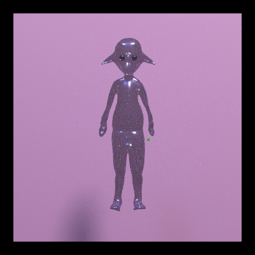
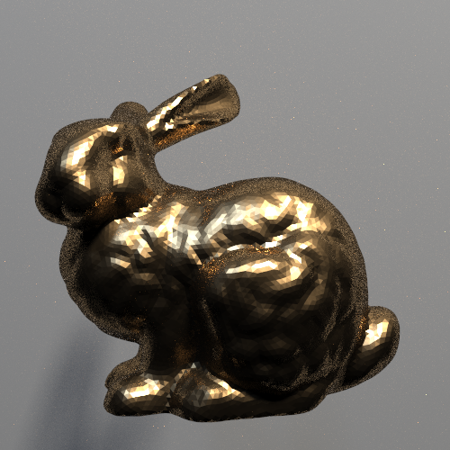
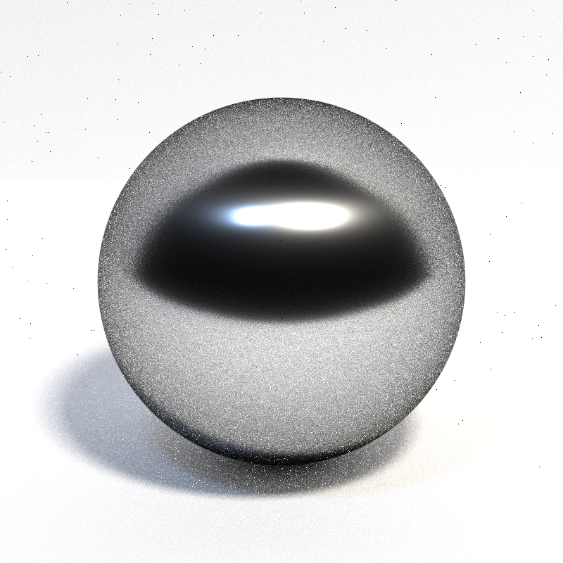
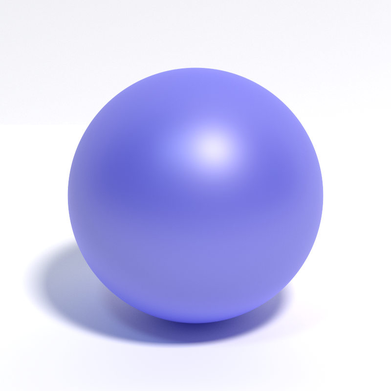

# Final Project Proposal

So these past few weeks have been these past few weeks. I made a poor decision to switch from optix 6.0 to 9.0 and that took forever to figure out. Then I had to refactor everything which took forever. And then I had to try and get multiple importance sampling working, which the auto grader said I didn't but I think I did probably. But anyways, despite these tribulations I am having a fun time working on this, and it is far more interesting and entertaining than caches and branch predictors. I am thankful. 

The first part of my plan is to implement disney brdf. There is a homework assignment from cse272 that explains how to do it. I wanted to implement this so I can get more practice with the sampling ideas, and I want cool materials that are more intuitive to describe. It has 5 different techniques, and I got the evaluate function for all of them working. I still need to set up glass to allow for refraction. I have a couple test photos.

You can see that the very smooth metal looks bad right up against the floor due to a lack of brdf importance sampling. The anisotropic stuff makes sampling harder; There is some VNDF sampling routine I still need to understand to get all the sampling set up. Since there are 4 important lobes I want to mis them because I'll have the pdf for each lobe anyways. 

After I finish that up, the plan is to make a bidirectional pathtracer. And after that to get a scene going. I am thinking some steel armor and some glass bottles and some glowing fairies and a little knight. To really show what the renderer can do. But knowing me that won't get done at all. Disregard the NANs. Sans nans c'est breve et al. 

