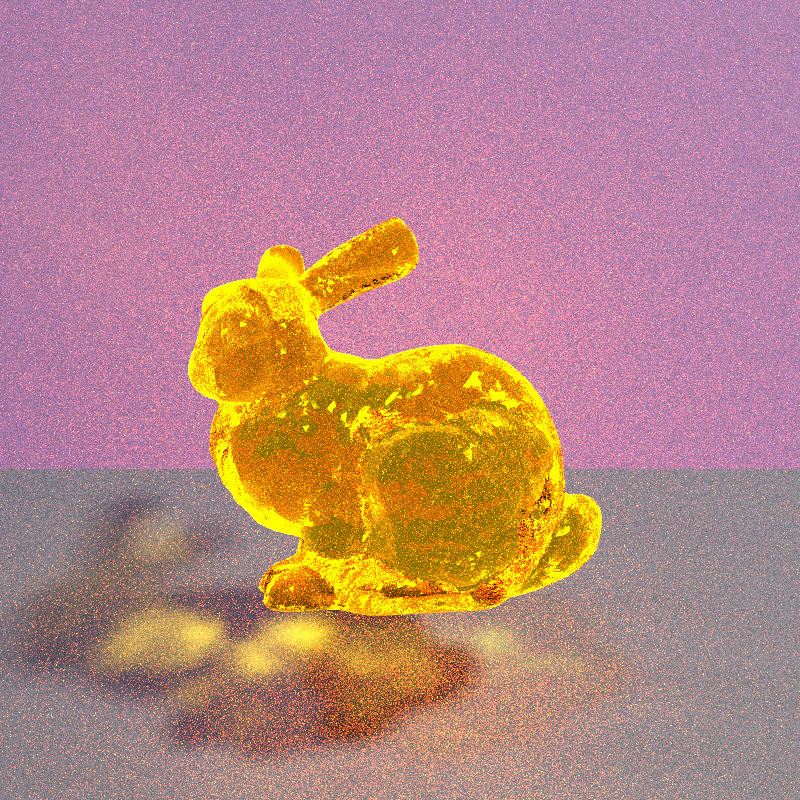
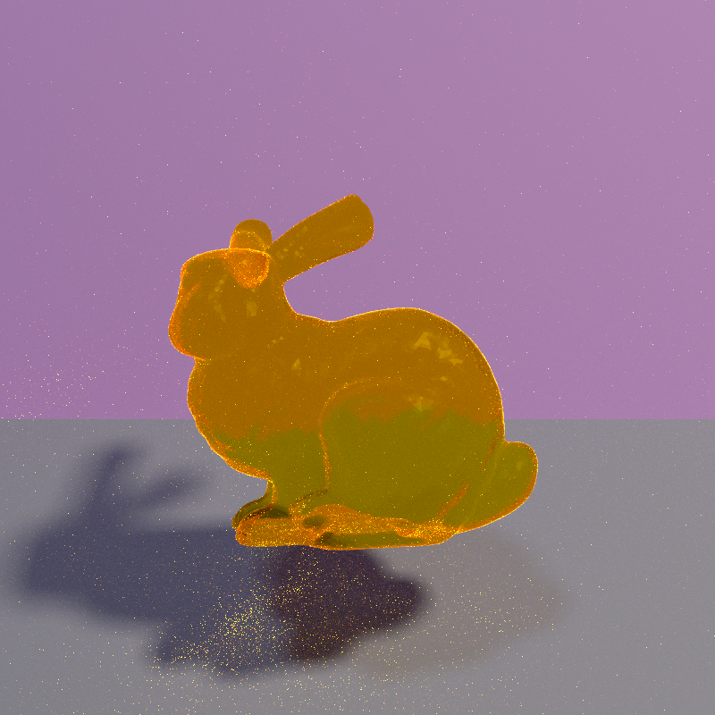
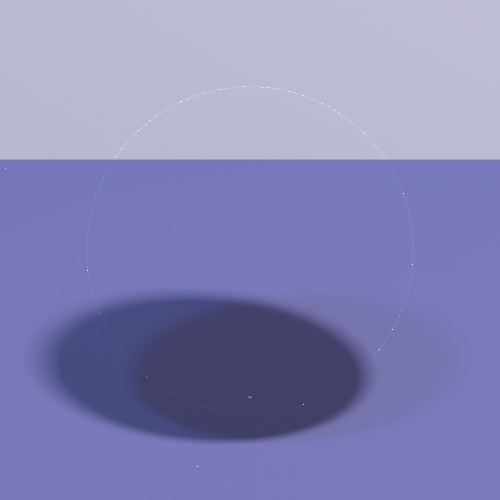
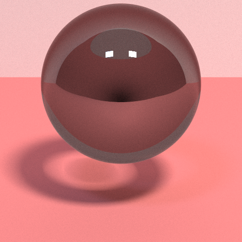
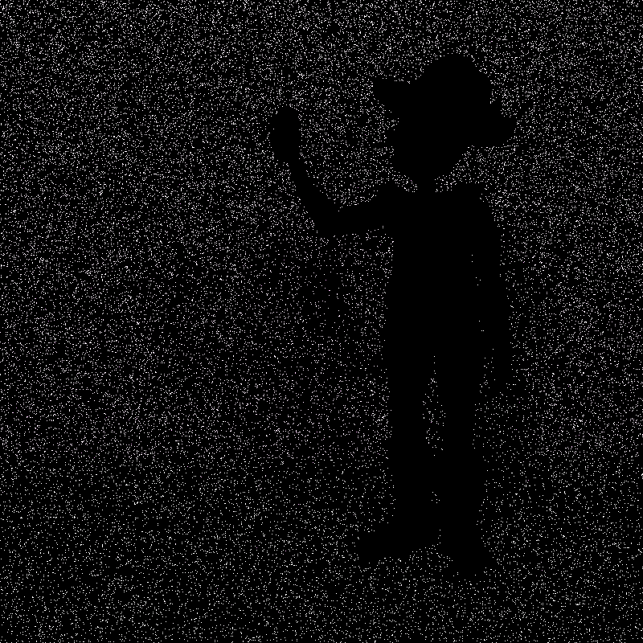
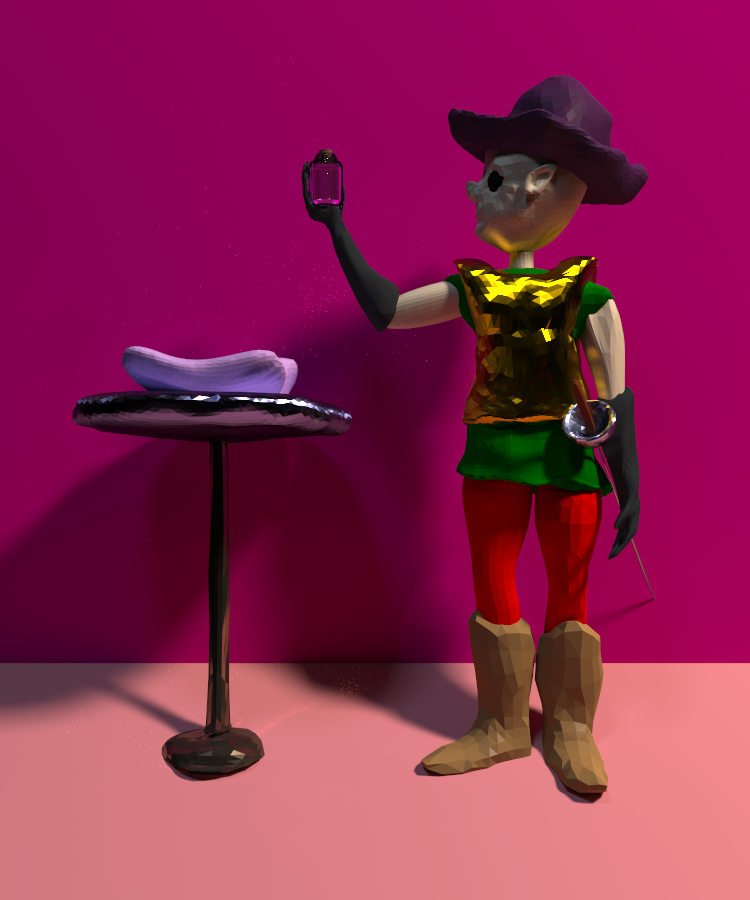
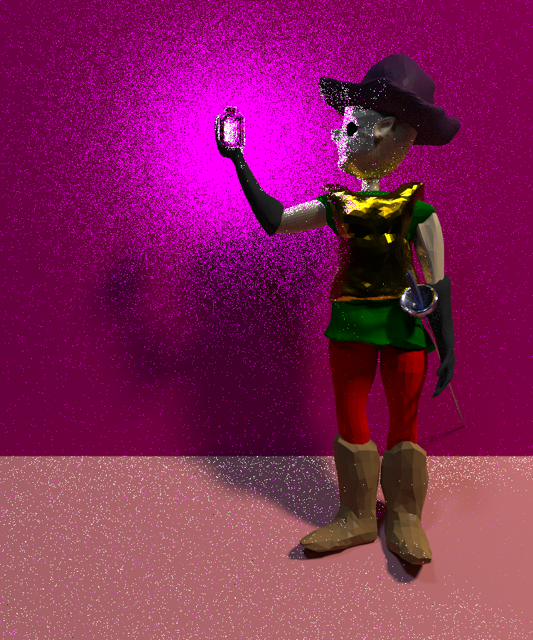

# Final Project

It is over. I didn't get the bidirectional pathtracer. I've been working nonstop for weeks now and I was too tired. So all I got is the disney brdf. I spent today making models and getting them into Blurser and picking materials for them. Then I spent all day trying to get the dumb glass bottle to work. The energy blew up and I kept trying to tweak the parameters to get it to look decent and I couldn't.

Here is a honey bunny. You can see through it! I turned off nee because it lets caustics show better. I could not figure out a reasonable way to get nee to work with the transparent objects. One idea is to just let light shoot straight through til it hits something non transparent. But I didn't bother working that out. Another idea is to use the result from when a ray hits a light from its randomwalk, but when I tried that the images would get noisy, so there must be a better way to weigh nee and indirect lighting. 

As you can see, the light on the floor looks awful with nee. The tradeoff is that the image is not noisy everywhere else.

As you can see, air has nice soft diffuse shadows. And a bright white outline!

Anyways, after getting the glass lobe setup -- very tedius because one must keep track of refraction and reflection and whether the ray is inside or outside of a medium -- came the challenge of brdf sampling everything. All the lobes are slight variations of the ggx we did in homework, so I had a place to work from. But issue arose when attempting to sample the anisotropic metals and glass. The technique I used is in one of the papers down below, but it comes down to transforming from like an ellipsoid frame to a hemisphere frame and sampling the half vector there, then transforming that back to the ellipsoid frame.

I sadly didn't take anymore photos of metal spheres. I should have.

Here's another glass ball

One of the largest issues I had is that I never know how anything is supposed to look. There is a little circle under that glass ball, and a shadow around it. But who knows if that is what I'd see if I put a glass ball with eta = 1.4 and specularTransmisison = 1 and diffuse = 1 1 1 against that background at that angle. I want to implement textures so I can get those cool checker patterns that the pros use in the glass demos, because the image above is unsensible.

Everytime a sample is taken, the probability of that sample coming from each lobe is computed. Then I update the probability of the actual sample as the power heuristic with beta = 2 divided by the pdf. Then the probability I return is the reciprocal. I think that makes sense. For my disney bsdf I only allow for brdf sampling, so I didn't get to test it without this technique, but results seem to look fine. 

Now that the groundwork has been layed and the soils are ready for troddening, the goal was to get a scene that looks decent, uses a lot of the disney bsdf materials, and executes my artistic vision. I have been having intense artistic episodes where these renders all come to me, and I can see the scene and the geometry and the subjects all there for the taking. But I couldn't achieve any of them. A month ago I wanted a fairy in a bottle like Zelda. But fairies are emissive, and it would be within glass, so I am willing to bet this would be the noisiest image with my meagre Blurser. Also, I'd need spherical lights. Then the thoughts of terror came, and I wanted to make a scary cursed scene that was dark and had big cold anisotropic metal with harsh bright glares. And I'd put the soblin in there and a beast above them drooling. But I walked out of my final last evening and came to my senses that that would be overly negative.

Finally I opted for this little musketeer european cowboy with gold armor, coal eyes, leather boots, red tights, a green shirt, white skin, no hair, a purple cap, a toy rapier, and dark gray gloves. 

I spent last night modeling him and the gadgets and I spent today trying to get the render looking good. I had to write a script to parse the blender scene and get it into a bunch of object files. After I could write a scene file with all the objects and give each a material and transformation. When porting to Optix 9 I had to learn about how its shading binding tables work and figure out how to get all the geometry into a vertex buffer. I don't even have primitives like spheres or triangles, I just send over a buffer of all the vertices for each triangle in the right order and then it can build and intersect the geometry. For spheres, I assume an instance of a unit sphere, and then make new instances of that same unit sphere with a different material and transformation. I don't know if that is slow, but it was the only way I could figure out how to use the built in sphere intersection and also get ellipsoids. 

The european cowboy musketeer approaches a staggering door, menacing and heavy. Mustering his back, he pushes the door open. There is red. And and a brass and silver table. Atop is a pillow. Atop is a bottle. He approaches the table and takes the bottle from the pillow. The bottle fits in his hand. He seems to see that it holds nothing. What a waste of life.

He turns around, sighs, stares at the ground. He sulks away, the impotent bottle beside him. The door feels so far away. Yet it feels less far than the lengths he's traveled in pursuit of glass. Behind him burns. Flash; his hand is fire.

Final remarks:

This course has opened my eyes and I will never sleep again. The process I used to get the materials for the scene was not pleasant. I would change a material slightly, then rerender the image and see how it looked. I was doing this at 256 spp with nee like a doofus, so it took like 5 seconds to get the image out. And I did that a hunderish times til I got the guy looking how I wanted. It is flat shaded because I haven't implemented smooth shading. Interestingly, more triangles and no smooth shading does not mean a smoother picture. I got pretty blursed aliassing on the soblin that I turned in for the milestone. So I definitely need to get smooth shading set up. 

The materials used for the table are metallic, the armor is metallic, the boots, hats, and gloves are diffuse with some clearcoat on them. The clearcoat isn't very noticeable, at least to me. The ears and face has some of the faking subsurface scattering effect on it, but it just makes it look dark instead of making the outer ear glow orange. The tights are just diffuse. The pillow is diffuse. The bottle is glass and the lid is cork. The hilt of the poker is metallic. My favorite part of the metals is how the reflections look when roughness is low. Also the glow from the gold, or the glow from the silver onto the body of the cowboy musketeer is pretty. It reminds of the brief case in pulp fiction. 

Plans for the future are getting textures, seting up bidriectional path tracing -- I read the veach ch9 on it multiple times but still haven't gotten around to implementing it -- , smooth shading, manifold exploration, volumetric rendering( the morning before the most excellent Nithin lecture there was a guy working on some volumetric rendering so I hope that project ended up beautifully), and I want to make a tool that would allow me to test materials more easily. Anyways, I did awful this quarter in all my classes and I am normally a great student. It is depressing because I put more time in than ever. But I just wasn't understanding anything, and at the end of the day didn't want to do any of it. I got into bsms for computer engineering here, but I don't want to spend my life engineering transistors. I couldn't care less. Have a nice summer! 

References:

Microfacet Models for Refraction through Rough Surfaces: Walter et al.

Sampling the GGX Distribution of Visible Normals: Eric Heitz

Extending the Disney BRDF to a BSDF with Integrated Subsurface Scattering: Brent Burley

UCSD CSE272 Disney Principled BSDF
